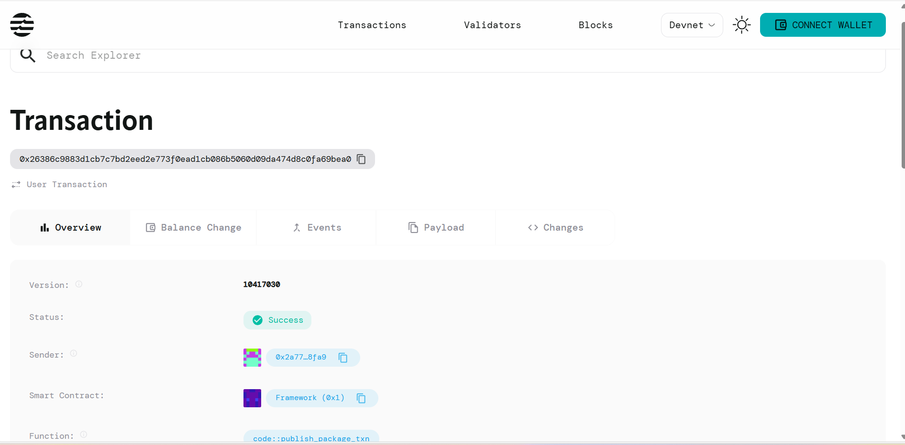

# Certificate Authority

## Project Description

A decentralized certificate issuance system built on the Aptos blockchain that enables trusted authorities to issue, manage, and verify digital certificates. This smart contract eliminates the need for centralized certificate authorities by leveraging blockchain technology to create tamper-proof, verifiable digital credentials.

## Project Vision

Our vision is to revolutionize the digital certification landscape by creating a transparent, secure, and decentralized system where certificates can be issued, verified, and managed without relying on traditional centralized authorities. We aim to provide a trustless environment where the authenticity of certificates is guaranteed by blockchain technology, making credential verification instant and globally accessible.

## Key Features

- **Decentralized Certificate Issuance**: Authorities can issue digital certificates directly on the blockchain
- **Immutable Record Keeping**: All certificates are stored permanently on the blockchain, preventing tampering or forgery
- **Transparent Verification**: Anyone can verify the authenticity of a certificate using the blockchain
- **Authority Management**: Initialize and manage certificate authorities with proper access controls
- **Certificate Registry**: Comprehensive tracking of all issued certificates with metadata
- **Timestamp Verification**: Each certificate includes an issue date for temporal verification
- **Hash-based Security**: Certificates are referenced by cryptographic hashes ensuring data integrity
- **Recipient-based Storage**: Certificates are associated with specific recipient addresses for easy retrieval

## Future Scope

- **Multi-signature Authority**: Implement multi-signature requirements for high-value certificates
- **Certificate Expiration**: Add expiration dates and automatic invalidation mechanisms  
- **Revocation System**: Enable authorities to revoke certificates when necessary
- **Certificate Templates**: Create standardized templates for different types of certificates
- **Batch Issuance**: Allow authorities to issue multiple certificates in a single transaction
- **Cross-chain Integration**: Enable certificate verification across different blockchain networks
- **Identity Verification**: Integrate with identity verification services for enhanced security
- **Analytics Dashboard**: Provide comprehensive analytics for certificate authorities
- **Mobile Integration**: Develop mobile applications for easy certificate management and verification
- **API Gateway**: Create RESTful APIs for seamless integration with existing systems
- **Compliance Framework**: Add regulatory compliance features for different jurisdictions
- **Certificate Marketplace**: Enable trading or transfer of certain types of certificates

## Contract Details
0x26386c9883d1cb7c7bd2eed2e773f0ead1cb086b5060d09da474d8c0fa69bea0
